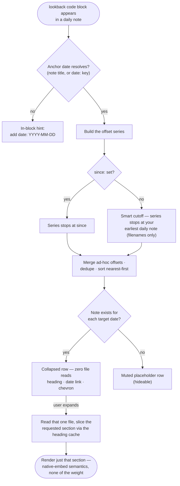
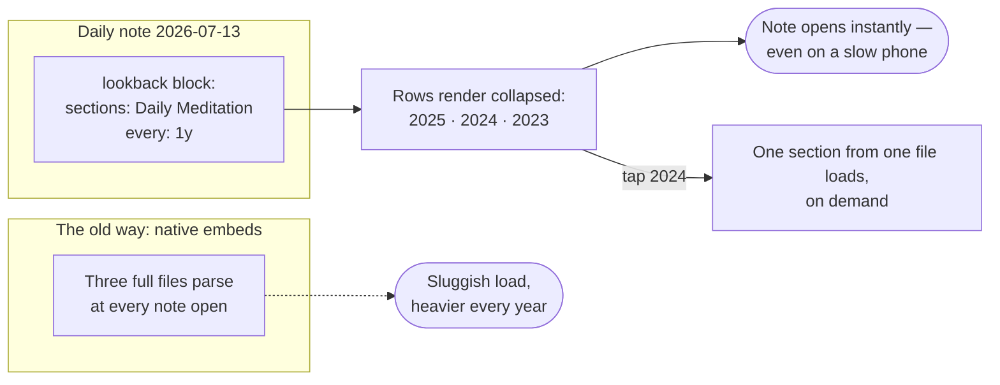

# Daily Note Lookback

> *"Life can only be understood backwards; but it must be lived forwards."* — Søren Kierkegaard

An [Obsidian](https://obsidian.md) plugin for journals that have started to accumulate years. Drop a tiny code block into your daily note and it renders a **Chrono Retrospection**: what your chosen sections said one year ago, two years ago, three — or one month ago, or eleven days ago, on any schedule you like. Every row arrives collapsed and costs **zero file reads** until you expand it. Your daily note opens instantly, on desktop and on the phone that used to chug.

## Why this exists

A journal grows one day at a time, and after a few years today's page starts wanting to talk to its ancestors. The standard recipe: a template script that stamps native `![[2024-07-13#Daily Meditation]]` embeds into every new note. It works — and then it taxes you forever. Native embeds load and render the **entire source file** at every note open. Each anniversary adds another full parse to the pile. The habit you built to move faster now makes every morning slower, and mobile feels it worst.

That trade never belonged in the deal. A lookback needs three things at open time: which dates matter, whether a note exists there, and a handle to pull on. None of that requires reading a single file. The reading can wait until you actually reach for a memory — so here, it does. Rows render as a light index; content loads per-section, per-file, on demand; and the template script that generated stale embed lists retires entirely.

Nothing else did this, so this had to exist. Now it does, and you can have it for free.

## How it works



Section extraction matches what a native `![[note#heading]]` embed would show — from your heading to the next heading of equal or higher rank — but it slices via Obsidian's metadata cache instead of re-parsing files, and only for the one row you opened. Heading matching tolerates emphasis marks and case by default, so `sections: [Daily Meditation]` finds `### _Daily Meditation_` without ceremony.

## A day in the life

One journaler wants to see how their meditations read across the years, with minimal overhead — especially on a phone, where the old embed pile loaded slowest:



## Setup

1. **Install** (see below) and enable the plugin.
2. **Add a block to your daily note template** — under whatever heading you like:

   ````markdown
   ### _Chrono Retrospection_
   ```lookback
   sections: [Daily Meditation]
   ```
   ````

   An empty block works too: it falls back entirely to your settings, looks back yearly, and shows the whole note on expand.
3. **Open a daily note.** Rows appear for each year (or interval) back to your earliest note. Click a chevron or heading to expand; click the date to open the note; hover the date for Obsidian's page preview; use the corner arrows on expanded content to jump to the source.

The plugin reads your Daily Notes (or Periodic Notes) folder and date format automatically — vaults with formats like `YYYY-MM-DD-dddd` or nested `YYYY/MM/YYYY-MM-DD` paths resolve without configuration.

## Block reference

Every key stays optional; every key overrides the matching setting for that one block. Four fence aliases render identically: `lookback`, `lb`, `daily-note-lookback`, `chrono`.

````markdown
```lookback
sections: [Daily Meditation, Dream Log]  # headings to extract; empty = whole note
every: 1y                                # recurring step: 1y, 3m, 2w, 11d
since: 2023-09-03                        # optional hard stop; empty = smart cutoff
offsets: [1w, 1m, 3m]                    # ad-hoc distances, merged with the series
date: 2026-07-13                         # anchor override for non-daily notes
heading: 4                               # rendered heading weight, 1-6
expanded: true                           # start expanded instead of collapsed
folder: Daily Notes                      # override auto-discovery
format: YYYY-MM-DD                       # override auto-discovery
missing: hide                            # hide placeholder rows for absent notes
style: elegant                           # default | minimal | elegant | ornate
accent: rebeccapurple                    # any CSS color; empty = theme accent
```
````

Yearly rows label as the bare year (`2024`); other intervals label as the date plus a caption like `3 months ago`. Explicit `offsets` always render, even past the cutoff — you asked for them by name.

## Styles

Colors always flow from your active theme — the accent rule, dots, and flourishes pick up the theme's accent color automatically, and `accent:` (per block or in settings) swaps in any CSS color you like. On top of that, four presets set the typographic mood:

- **default** — clean accent rule, slightly enlarged headings; disappears into most themes.
- **minimal** — quiet monochrome hairline, no dots, no background; for people who find the default too loud.
- **elegant** — your reading typeface on the headings, italic captions, bordered content; the in-between.
- **ornate** — small caps, a doubled rule, a printer's fleuron (❧) before each heading; a little ceremony for your archives.

## Settings

- **Block defaults** — every block key above, as a global default (including style and accent color).
- **Hover preview** — off by default; hovering a collapsed row pops up the extracted section without expanding it (reads the file only on hover).
- **Remember expansion state** — rows you expand stay expanded next time, per note, for the most recent 200 notes.
- **Strict heading match** — require the exact written heading, emphasis marks and case included.

## Commands

- **Insert lookback block** — drops a fresh fence at the cursor.
- **Refresh lookback blocks in active note** — recomputes everything, including the earliest-note cutoff.
- **Expand all / Collapse all lookback rows in active note** — also available as buttons on the block itself.

## Rules of the game

Every tool encodes assumptions; these deserve stating plainly rather than discovering painfully.

- **Collapsed rows cost nothing.** Rendering a block touches filenames and the metadata cache only. File contents load on expand (or on hover, if you switch hover preview on).
- **Nested archives resolve.** Row lookup tries the exact path in your daily folder first, then falls back to Obsidian's link resolution — the same search a `[[2025-07-14]]` wikilink performs — so notes moved into nested archive folders keep appearing.
- **Daily notes anchor the math.** The note's own title supplies the anchor date; a `date:` key covers everything else. Weekly or monthly periodic notes can host a block via `date:`, but v1 does not parse their titles.
- **Read-only rendering.** Lookback content renders like an embed — edits happen in the source note, one click away.
- **The recurring series needs a floor.** `since:` sets one explicitly; otherwise the earliest parseable daily note serves. With neither (an empty folder), only explicit `offsets` render.
- **Clamping follows the calendar.** Feb 29 minus one year lands on Feb 28; Mar 31 minus one month lands on the last day of February.
- **Privacy.** The plugin reads only your vault through Obsidian's own API, makes zero network requests, and phones home to nobody.

## Installing

Until the plugin lands in the community catalog, install with [BRAT](https://github.com/TfTHacker/obsidian42-brat) pointed at this repo, or copy `main.js`, `manifest.json`, and `styles.css` from a [release](https://github.com/DyllonWright/Obsidian-Daily-Note-Lookback-Plugin/releases) into `<vault>/.obsidian/plugins/daily-note-lookback/`.

Works on desktop and mobile.

## Developing

```bash
npm install
npm run dev     # esbuild watch mode
npm run build   # typecheck + production bundle
npm test        # engine test suite — keep it green
```

The engine (`src/engine.ts`) holds all date math, interval grammar, config coercion, and section slicing, and imports nothing from Obsidian — the test suite exercises it directly in Node. The shell (`src/main.ts`, `src/render.ts`, `src/settings.ts`) handles code-block processors, DOM, persistence, and the settings tab. Editable diagram sources live in `diagrams/` (`.mmd` + `.excalidraw`).

One stylistic note for contributors: the README and UI text keep to [E-Prime](https://en.wikipedia.org/wiki/E-Prime) — English without any form of "to be" — as a small tribute to Korzybski and Robert Anton Wilson, who argued that dropping "is" makes claims about *what happened* easier to tell apart from claims about *what things really are*. A plugin built for re-reading your own past might as well practice careful language about it.

## License

MIT
